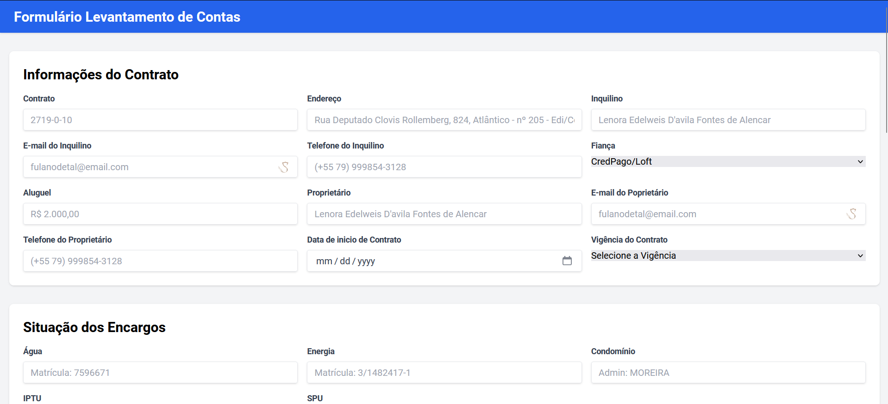
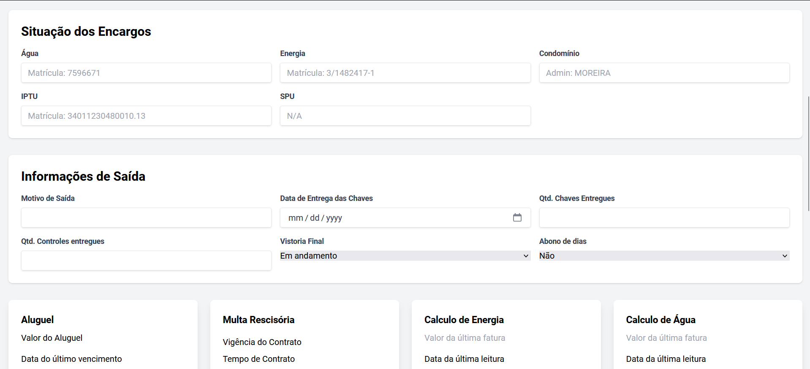
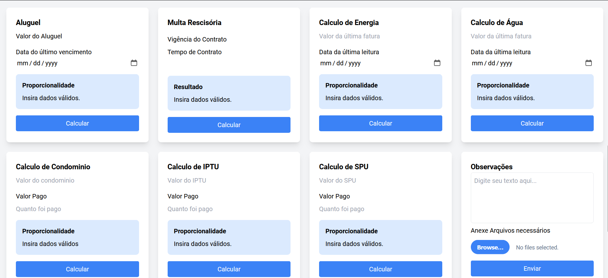
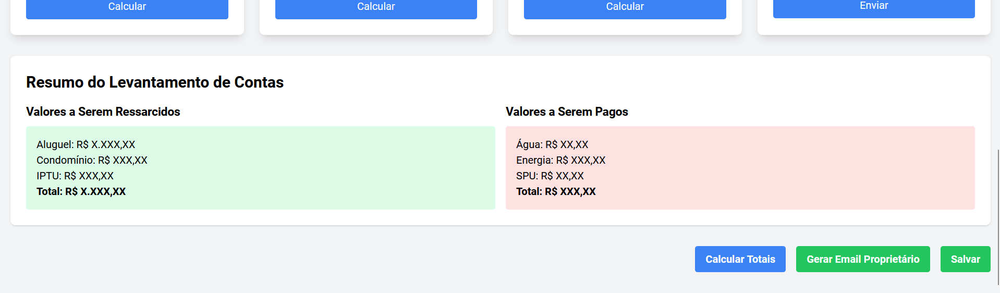

# Projeto de Cálculos de Aluguel e Despesas

Este projeto é um aplicativo web que realiza cálculos relacionados a contratos de aluguel e despesas associadas, como aluguel, multas, contas de água, energia, condomínio, IPTU e taxa de serviços públicos (SPU).

## Descrição

O aplicativo permite que os usuários insiram informações como datas de contrato, valores de aluguel, leituras de medidores, pagamentos realizados, etc. Com base nesses dados, o aplicativo calcula os valores proporcionais das despesas que o inquilino deve pagar ou ser ressarcido.

O objetivo principal do projeto é fornecer uma ferramenta útil para proprietários de imóveis, administradores de condomínios e inquilinos, facilitando o processo de cálculo e ajuste de contas no final de um contrato de aluguel.

## Funcionalidades

- Cálculo do valor proporcional do aluguel com base nas datas de contrato e pagamento
- Cálculo da multa rescisória em caso de rescisão antecipada do contrato
- Cálculo do valor proporcional das contas de água e energia com base nas datas de leitura e valores das contas
- Cálculo do valor proporcional das taxas de condomínio, IPTU e SPU com base nas datas de contrato e valores das taxas

## Tecnologias Utilizadas

- **Frontend:** HTML, Tailwind CSS, JavaScript (ES6+)
- **Planejamento da refatoração:** Migração para Next.js, utilizando API routes para persistência de dados e melhoria na performance, além de TypeScript para escalar o projeto para melhorias futuras. 

## Screeshots
Formulário

> As imagens ilustram o funcionamento do sistema, desde a entrada de dados até o resultado dos cálculos e geração de relatórios.

## Instalação e Uso

1. Clone este repositório: `git clone https://github.com/EderSouza93/Calculo-Rescis-o.git`
2. Navegue até o diretório do projeto: `cd CALCULO-RESCI-O`
3. Abra o arquivo `index.html` em um navegador web.

## Futuras Atualizações 

 ### Refatoração com Next.js
  - Migração para Next.js para melhorar a performance, SEO e estrutura modular do projeto.
  - Utilização de API routes para salvar e recuperar dados.
  - Utilização de TypeScript para adição de tipagem estática.
 ### Persistência de Dados
  - Criar um endpoint para salvar os dados no banco de dados, permitindo que os usuários   
    retomem o levantamento em qualquer momento.
 ### Máscaras para Campos
  - Adicionar máscaras nos campos de moeda e contrato, utilizando regex para validação.
 ### Envio de E-mails
  - Implementar o envio de e-mails com opção de revisão prévia, garantindo que o sponsor possa 
    validar as informações antes do envio.
 ### Novos Campos
  - Adicionar campos para:
    - E-mail: Para facilitar o envio de mensagens.
    - Telefone: Para comunicação direta.
 ### Relatórios e Arquivos Anexos
  - Permitir o upload de arquivos.
  - Gerar relatórios em PDF contendo as informações do cálculo e os arquivos anexados.
    Tecnologias sugeridas: jspdf, pdf-lib ou similares.
 ### Avaliação de POO
  - Revisar a lógica atual para avaliar a necessidade de implementar Programação Orientada a 
    Objetos (POO), visando modularidade e facilidade de manutenção.

## Licença

Este projeto está licenciado sob a [ISC](LICENSE).
